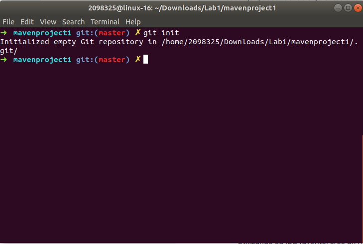
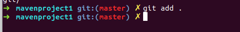
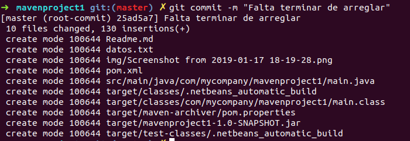

Aqui mostraremos como se desarrllo un ejercicio basico usando java para resolver un ejercicio en Java.

Ademas, se mostrara como se uso git y los comandos que se usaron para que todo estuviera correcto, a continuacion se mostrara los pasos por imagenes.

Cuando el laboratorio esta listo, se realiza un git init y de esta manera se inicializa el directorio donde se encuentra el proyecto en git.

 

Despues se realiza un . add, y de esta manera se agrega todo los cambios que se hayan realizado.

 

Seguido se realiza el commit, el cual es un mensaje que se añade a todos los cambios realizados(agegados/eliminados) que se hayan realizado en el proyecto.

Con un nombre significativo

